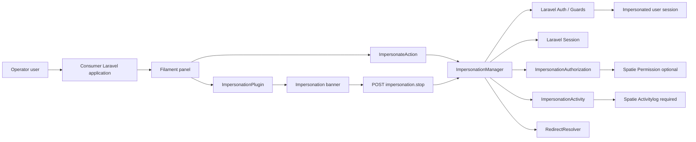
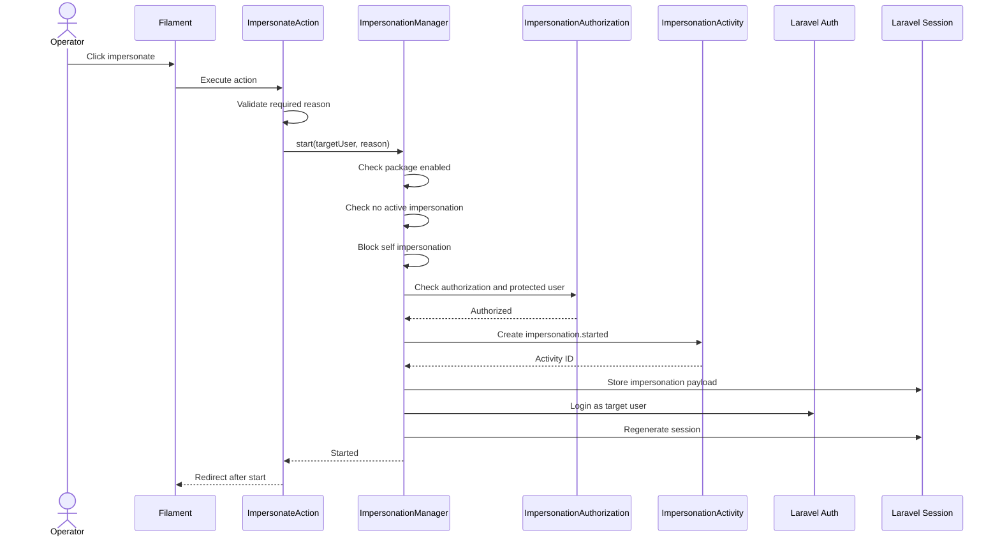
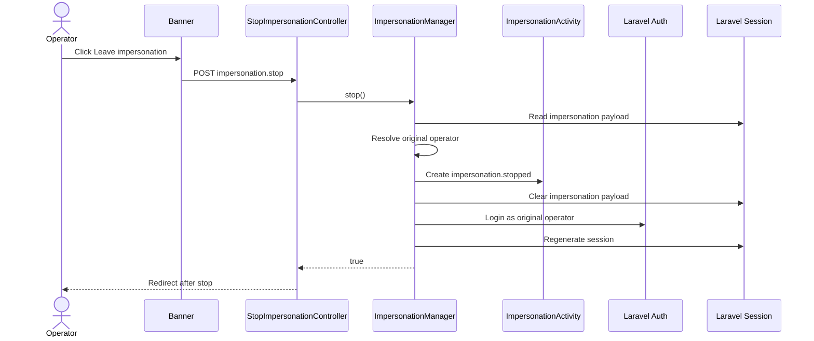
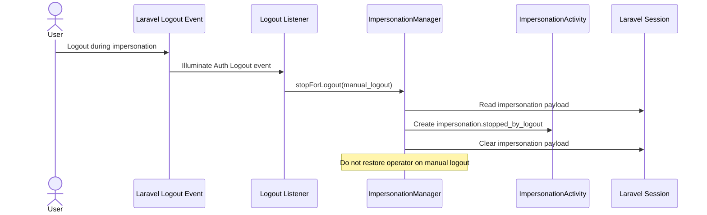
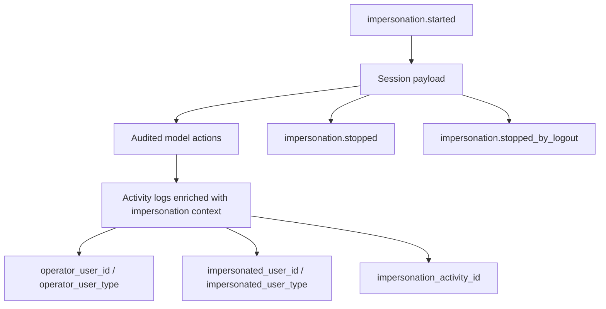

# Filament Impersonation - Architecture Map

## Purpose

This document provides a high-level architecture map for the `chuimi/filament-impersonation` package.

It is intended to give architects, maintainers and implementation agents a quick overview of the package boundaries, runtime components and integration points.

For detailed design decisions, see:

```text
docs/ARCHITECTURE.md
```

---

## High-level goal

`chuimi/filament-impersonation` provides controlled and audited user impersonation for Laravel + Filament applications.

The package allows an authorized operator to temporarily authenticate as another user while preserving auditability of the real operator.

---

## Runtime architecture



---

## Component overview

### Consumer Laravel application

The host application where the package is installed.

Responsibilities:

- register the package through Laravel autodiscovery;
- publish and customize configuration if needed;
- register the Filament plugin in the desired panels;
- add the reusable impersonation action where appropriate;
- decide which models should receive impersonation audit context.

---

### Filament panel

The administrative UI where impersonation is exposed.

The package does not automatically inject actions into every resource.

The consuming application decides where to place:

```php
ImpersonateAction::make()
```

The package plugin is registered manually per panel:

```php
ImpersonationPlugin::make()
```

Once registered, the impersonation banner is mandatory while impersonation is active.

---

### ImpersonateAction

Reusable Filament Action provided by the package.

Responsibilities:

- check whether the current operator can impersonate the target user;
- show the required reason form;
- validate the reason using package configuration;
- call `ImpersonationManager::start()`;
- show translated success/error notifications;
- redirect after successful start.

This action is added manually by the consumer.

---

### ImpersonationPlugin

Filament plugin provided by the package.

Responsibilities:

- register the mandatory impersonation banner;
- show the banner only while impersonation is active;
- provide visible access to “Leave impersonation”.

The plugin is registered manually in each Filament panel where impersonation can be used.

---

### Impersonation banner

Security signal shown during an active impersonation.

Responsibilities:

- clearly indicate that impersonation is active;
- show the impersonated user context;
- provide a visible “Leave impersonation” action;
- submit to the package stop route.

The banner must not be disableable in the first version.

---

### Stop route and controller

The normal exit flow uses a POST route.

Default route:

```text
POST /impersonation/stop
```

Default name:

```text
impersonation.stop
```

Default middleware:

```php
['web', 'auth']
```

Flow:

```text
Banner -> POST route('impersonation.stop') -> StopImpersonationController -> ImpersonationManager::stop()
```

---

### ImpersonationManager

Central runtime coordinator of the package.

Responsibilities:

- start impersonation;
- stop impersonation;
- stop impersonation during logout;
- expose `isImpersonating()`;
- expose `payload()`;
- coordinate session, authentication, authorization and audit logging.

Main methods:

```php
start(...)
stop(): bool
stopForLogout(...)
isImpersonating(): bool
payload(): ?array
```

---

### Laravel Auth / Guards

The package performs a real authentication switch.

During impersonation start:

```php
Auth::guard($guard)->login($targetUser);
```

During normal stop:

```php
Auth::guard($guard)->login($operator);
```

The guard is configurable.

```php
'guard' => null,
```

Meaning:

- `null`: use the current guard;
- string: force a specific guard.

---

### Laravel Session

The package stores impersonation context in session.

The payload contains:

```text
operator_user_id
operator_user_type
operator_guard
impersonated_user_id
impersonated_user_type
impersonated_guard
impersonation_activity_id
started_at
```

The session is regenerated when impersonation starts and when it stops.

---

### ImpersonationAuthorization

Authorization component.

Responsibilities:

- check package enabled state;
- block nested impersonation;
- block self impersonation;
- block protected users;
- evaluate custom `can_impersonate` callback;
- evaluate configured roles and permissions;
- keep `spatie/laravel-permission` optional.

Relevant configuration:

```php
'can_impersonate' => null,

'operator_roles' => [],
'operator_permissions' => [],

'protected_roles' => [],
'is_protected_user' => null,
```

---

### ImpersonationActivity

Activity logging component.

Uses:

```text
spatie/laravel-activitylog
```

Activity events:

```text
impersonation.started
impersonation.stopped
impersonation.stopped_by_logout
```

The `impersonation.started` event is mandatory. If it cannot be created, impersonation must not start.

---

### RedirectResolver

Component responsible for resolving post-action redirects.

Configuration:

```php
'redirect_after_start' => null,
'redirect_after_stop' => null,
```

Each value may be:

- `null`;
- string;
- callable.

The package must not assume a fixed Filament dashboard route.

---

### HasImpersonationActivityContext

Manual trait for models using `spatie/laravel-activitylog`.

The consumer adds it only to auditable models that should receive impersonation context.

Responsibilities:

- enrich activity logs during impersonation;
- set the real operator as causer;
- preserve existing activity properties;
- add impersonation context to properties.

Added context:

```text
impersonation_activity_id
operator_user_id
operator_user_type
impersonated_user_id
impersonated_user_type
```

This trait is applied manually by the consuming application.

---

## Start flow



---

## Normal stop flow



---

## Forced stop / logout flow



---

## Audit model



---

## First implementation block

The first implementation block is limited to the core independent of Filament.

Included:

```text
config/filament-impersonation.php
src/ImpersonationManager.php
src/Support/ImpersonationActivity.php
src/Support/ImpersonationAuthorization.php
src/Support/ImpersonationLogoutReason.php
src/Exceptions/*
tests/Feature/ImpersonationManagerTest.php
```

Out of scope:

```text
ImpersonateAction
ImpersonationPlugin
Banner automatic registration
StopImpersonationController
Routes
Logout listener
HasImpersonationActivityContext trait
```

---

## Planned package structure

```text
src/
├─ Concerns/
│  └─ HasImpersonationActivityContext.php
├─ Contracts/
├─ Exceptions/
├─ Filament/
│  ├─ Actions/
│  │  └─ ImpersonateAction.php
│  └─ ImpersonationPlugin.php
├─ Http/
│  └─ Controllers/
│     └─ StopImpersonationController.php
├─ Listeners/
│  └─ HandleImpersonationLogout.php
├─ Support/
│  ├─ ImpersonationActivity.php
│  ├─ ImpersonationAuthorization.php
│  ├─ ImpersonationLogoutReason.php
│  └─ RedirectResolver.php
├─ ImpersonationManager.php
└─ ImpersonationServiceProvider.php
```

---

## Architectural boundaries

The package owns:

- impersonation flow;
- impersonation session payload;
- impersonation audit events;
- reusable Filament integration points;
- optional permission integration;
- safe start/stop behavior.

The consuming application owns:

- where the impersonation action appears;
- which users may impersonate through config/callbacks;
- which users are protected;
- which panels register the plugin;
- which models use the audit context trait;
- application-specific authorization or user-restoration rules.

---

## Summary

At a high level, the package separates responsibilities as follows:

```text
Filament UI
  -> starts/stops impersonation

ImpersonationManager
  -> orchestrates runtime flow

Authorization
  -> decides whether impersonation is allowed

Activitylog
  -> records audit trail

Session
  -> stores impersonation context

Laravel Auth
  -> performs the real user switch

Consumer application
  -> decides where and how to integrate the package
```

This separation keeps the package reusable, auditable and compatible with different Laravel + Filament applications.
